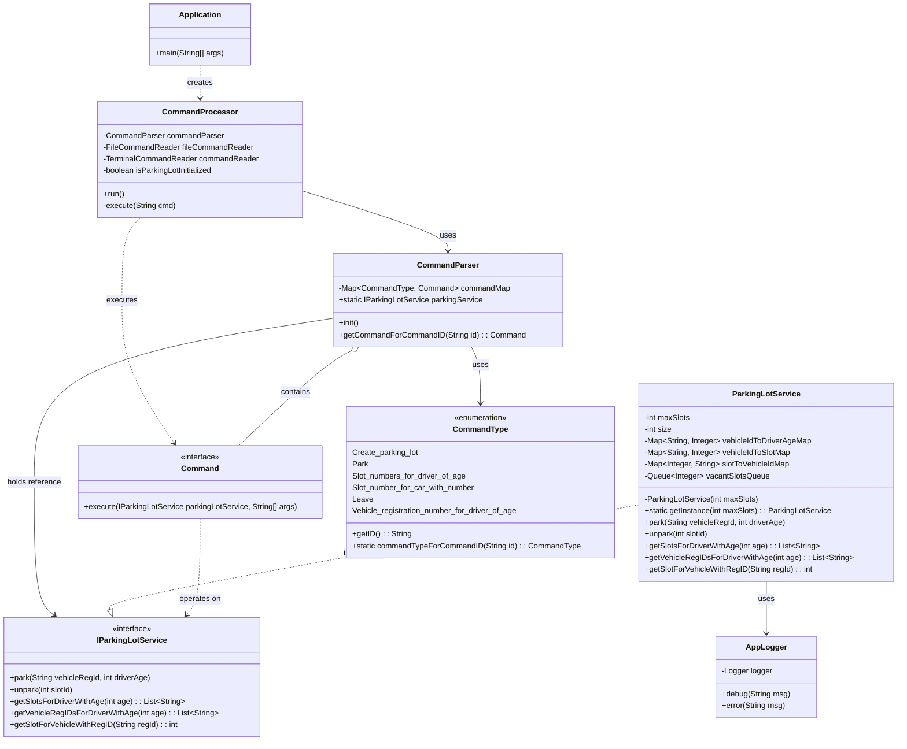
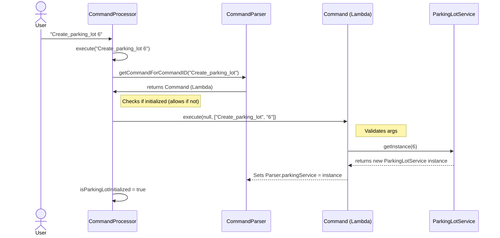
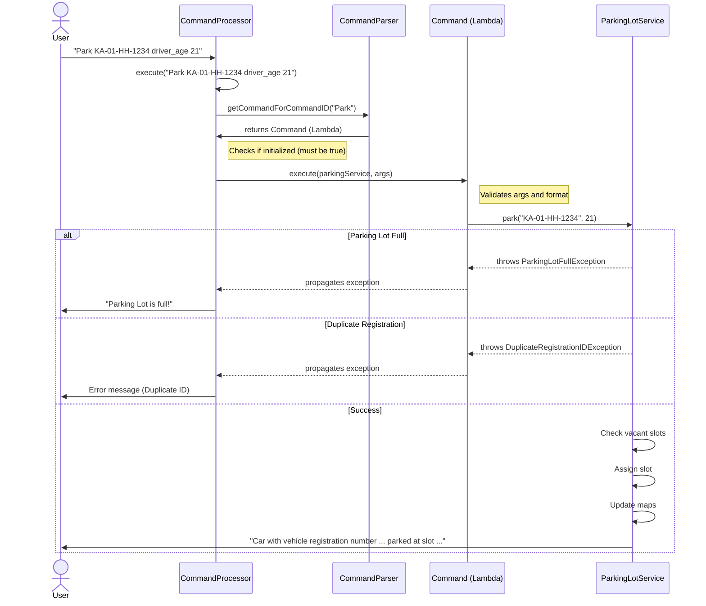

# Design Diagrams for ParkingLot Service

## Class Diagram

The following class diagram illustrates the structure of the ParkingLot application, showing the relationships between the main components such as `Application`, `CommandProcessor`, `CommandParser`, and `ParkingLotService`.

## Sequence Diagram: Create Parking Lot

This sequence diagram depicts the flow when the `Create_parking_lot` command is issued. This is a special command that initializes the `ParkingLotService`.

## Sequence Diagram: Park Vehicle

This sequence diagram shows the process of parking a vehicle. It assumes the parking lot has already been initialized.

